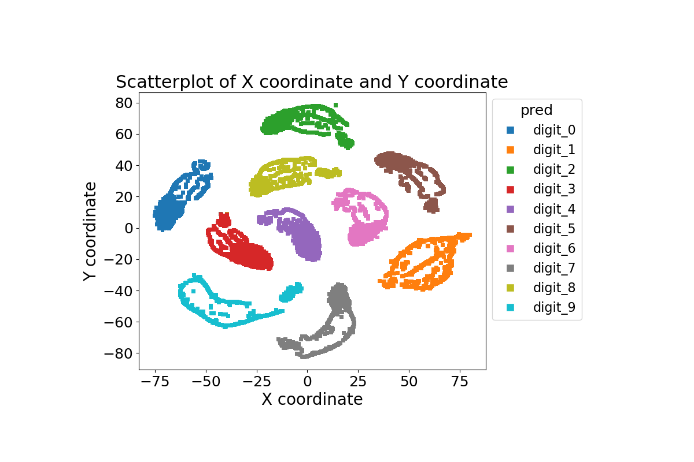
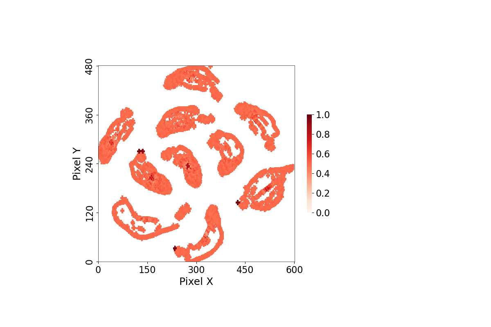

# O4AnI: A Novel Overlap Measure for Anomaly Identification in Multi-Class Scatterplots

## Overview
This project is designed to measure the overplotting of scatterplots in context of XAI, using advanced statistical and visualization techniques. The core of the project is the `Scatter_Metric` class, which provides functionalities for generating scatter plots, pixel matrices, heatmaps, and calculating quality metric values for scatterplots.

## Installation
Before running the scripts, ensure that the following Python packages are installed:

- matplotlib
- scipy
- numpy
- pandas
- scikit-learn

You can install these packages using pip:
```bash
pip install matplotlib scipy numpy pandas scikit-learn
```

## Usage
Key functionalities in `Scatter_Metric` class:
<!-- - `shap_plot_cal_matrix`: Generates SHAP plots and pixel matrices. -->
- `plot_scatter_cal_matrix`: Creates customizable scatter plots and pixel metrics.
- `visualize_pixel_matrix`: Heatmap visualization of pixel density.
<!-- - `plot_depth_complexity_histogram`: Histograms of depth complexity. -->
- `final_value_metrix`: Calculate the quality metric values.
-  `save_figure`: Save the scatterplots.
- `save_heatmap`: Save the heatmap.


## Example

### Data Example

The following table is a sample of the data used for analysis:

| id  | pred    | label   | eval | prob_0          | prob_1          | prob_2          | prob_3          | prob_4          | prob_5          | prob_6          | prob_7          | prob_8          | prob_9          | X coordinate | Y coordinate |
|-----|---------|---------|------|-----------------|-----------------|-----------------|-----------------|-----------------|-----------------|-----------------|-----------------|-----------------|-----------------|--------------|--------------|
| 0   | digit_7 | digit_7 | True | 6.760057e-27    | 3.826221e-36    | 6.735524e-20    | 1.093159e-25    | 1.261169e-44    | 1.091906e-38    | 4.820467e-43    | 1.0             | 1.225330e-35    | 1.265736e-21    | 13.364994    | -41.188786   |
| 1   | digit_9 | digit_9 | True | 3.818307e-27    | 2.375874e-20    | 3.166814e-21    | 3.368016e-17    | 1.813826e-10    | 7.348647e-19    | 3.362724e-26    | 9.799220e-15    | 3.898705e-13    | 1.0             | -31.387823   | -60.370834   |
| 2   | digit_2 | digit_2 | True | 1.157522e-17    | 4.266529e-10    | 1.0             | 1.285602e-18    | 2.417760e-18    | 4.679355e-21    | 5.051408e-15    | 8.900689e-26    | 4.219637e-18    | 7.580054e-30    | 4.835193     | 65.88922     |
| 3   | digit_9 | digit_9 | True | 1.255337e-25    | 1.025599e-21    | 2.220841e-22    | 1.069361e-17    | 5.062583e-13    | 8.794177e-18    | 4.847736e-27    | 7.162286e-13    | 2.827740e-16    | 1.0             | -47.098583   | -43.927925   |
| 4   | digit_1 | digit_1 | True | 8.016851e-17    | 1.0             | 3.115923e-09    | 4.520787e-15    | 7.699930e-13    | 1.154014e-14    | 3.100177e-13    | 2.861853e-12    | 1.189761e-10    | 5.286505e-15    | 48.73959     | -30.200827   |

### Code Example
```python
import os
import sys
sys.path.insert(0, os.path.abspath(os.path.join(os.path.dirname(__file__), '..')))
from datasets.generateData import load_data
from Our_metrics.Scatter_Metrics import Scatter_Metric
from datasets.generateData import load_data  # Ensure this module and function are correctly defined
import numpy as np

# Generating a quality metric class
analysis.plot_scatter_cal_matrix(
                        margins = {'left':0.2, 'right': 0.7, 'top':0.8, 'bottom': 0.2},
                        marker = 'plus_symbol', 
                        marker_size = 25, 
                        cmap='tab10',
                        dpi = 100, 
                        figsize= (10, 6),
                        xvariable = 'X coordinate', 
                        yvariable = 'Y coordinate',
                        zvariable='pred'
                        )

# Calculate the quality metric
score = analysis.importance_metric(important_cal_method = 'mahalanobis_distance', weight_diff_class=20, weight_same_class=1)
```


### Results
The results of the scatter plot and heatmap visualizations are saved as the following images:


Figure 1: Scatterplot generated from the data and specific parameters.

Figure 2: Heatmap illustrating which region hide more important information (important data points).

The calculated quality metric for this example is 0.24, which quantifies the level of overplotting in the scatterplot.