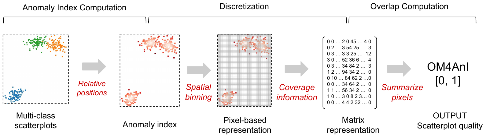

# OM4AnI: Overlap Measure for Anomaly Identification

OM4AnI measures overplotting in multi-class scatterplots and highlights where important information is obscured. The core `Scatter_Metric` class builds pixel-level representations, computes quality metrics, and produces scatterplots and heatmaps for identifying anomalies.

## Workflow

Below is the computation pipeline of OM4AnI:



## Installation

### 1. Requirements
- **Python:** 3.9 or higher (tested with 3.10 and 3.11).
- **Conda (Recommended):** We recommend using an [Anaconda](https://www.anaconda.com/) or [Miniconda](https://docs.conda.io/en/latest/miniconda.html) environment.

### 2. Setup Environment
Clone the repository and install the dependencies. The code is fully cross-platform and supports **Windows**, **Linux**, and **macOS**.

#### On Windows:
```bash
git clone https://github.com/llqsee/O4AnI_submission.git
cd O4AnI_submission

# Create and activate a conda environment
conda create -n om4ani python=3.9
conda activate om4ani

# Install dependencies
pip install -r requirements.txt
```
*Note: May require [Microsoft MPI](https://www.microsoft.com/en-us/download/details.aspx?id=57467) for `mpi4py`.*

#### On Linux (e.g., Ubuntu/Debian):
```bash
git clone https://github.com/llqsee/O4AnI_submission.git
cd O4AnI_submission

# Install system dependencies for MPI and UMAP
sudo apt-get update
sudo apt-get install libopenmpi-dev build-essential

# Create and activate a conda environment
conda create -n om4ani python=3.9
conda activate om4ani

# Install dependencies
pip install -r requirements.txt
```

### 3. Verify Installation
Run the environment check script to ensure all packages are correctly installed:
```bash
python utils/env_check.py
```

## Quickstart

You can immediately run the provided MNIST test script from the project root:

```bash
python test_MNIST/MNIST_test_mnist_pred_str.py
```

Or use the package in your own script:

```python
import os
import sys
from datasets.generateData import load_data
from Our_metrics.Scatter_Metrics import Scatter_Metric

# Load sample data (automatically resolves relative to project root)
data = load_data('datasets/mnist/mnist_pred_updated_str.csv')

# Configure the analyzer
analysis = Scatter_Metric(
    data=data,
    xvariable='X coordinate',
    yvariable='Y coordinate',
    zvariable='pred',
    marker_size=25,
    dpi=100
)

# Compute quality scores
score = analysis.importance_metric(
    important_cal_method='mahalanobis_distance', 
    weight_diff_class=100, 
    weight_same_class=0, 
    order_variable='importance_index', 
    asending=True
)

print(f"OM4AnI score: {score:.4f}")

# Save results (directories are created automatically)
analysis.save_figure('output/my_scatterplot.png')
analysis.save_heatmap('output/my_heatmap.png')
```

## Project Structure

- `Our_metrics/`: Core implementation of the `Scatter_Metric` class.
- `datasets/`: Data loading utilities and sample datasets (MNIST, Adult Income, Simulated).
- `utils/`: Helper functions for distance calculations, density analysis, and plotting.
- `test_*/`: example scripts and test cases for different datasets.

## Data Format

OM4AnI expects tabular data (CSV) with at least three columns:
- Two numerical columns for coordinates (e.g., `X coordinate`, `Y coordinate`).
- One categorical column for labels (e.g., `pred` or `label`).
- (Optional) Probability columns for advanced importance weighting.

## Citation

If you use OM4AnI in your research, please cite our paper:

> L. Liu, L. Bogachev, M. Rezaei, N. Ravikumar, A. Khara, and M. Azarmi, "OM4AnI: A Novel Overlap Measure for Anomaly Identification in Multi-Class Scatterplots," *IEEE Transactions on Visualization and Computer Graphics*, 2025. [https://doi.org/10.1109/TVCG.2025.3642219](https://doi.org/10.1109/TVCG.2025.3642219)
