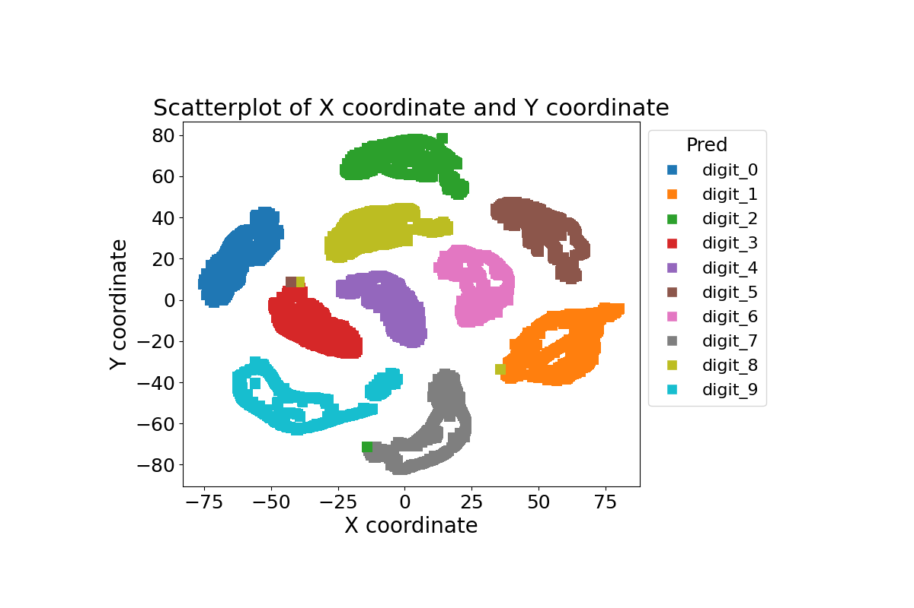

# OM4AnI: Overlap Measure for Anomaly Identification

OM4AnI measures how much anomalies hidden in multi-class scatterplots. The core `Scatter_Metric` class builds pixel-level representations, computes quality metrics for identifying anomalies.

## Workflow

Below is the computation pipeline of OM4AnI:


## Installation

### 1. Requirements
- **Python:** 3.9 or higher (tested with 3.10 and 3.11).
- **Conda (Recommended):** We recommend using an [Anaconda](https://www.anaconda.com/) or [Miniconda](https://docs.conda.io/en/latest/miniconda.html) environment.

### 2. Setup Environment
Clone the repository and install the dependencies. The code is fully cross-platform and supports **Windows**, **Linux**, and **macOS**.

#### On Windows:
```bash
git clone https://github.com/llqsee/O4AnI_submission.git
cd O4AnI_submission

# Create and activate a conda environment
conda create -n om4ani python=3.9
conda activate om4ani

# Install dependencies
pip install -r requirements.txt
```

#### On Linux:
```bash
git clone https://github.com/llqsee/O4AnI_submission.git
cd O4AnI_submission

# Create and activate a conda environment
conda create -n om4ani python=3.9
conda activate om4ani

# Install dependencies
pip install -r requirements.txt
```

<!-- ### 3. Verify Installation
Run the environment check script to ensure all packages are correctly installed:
```bash
python utils/env_check.py
``` -->

## Quickstart

You can immediately run the provided MNIST test script from the project root:

```bash
python main.py
```

The experiments use parameter settings λ = 0 and β = 100, and compute the anomaly index with the Average Linkage Method.

## Implementation results
After execution, two scatterplots are saved to `figures/`, and the VQM scores are printed in the console. They are shown below:

  
This corresponds to Figure 1 (a) in our paper (https://doi.org/10.1109/TVCG.2025.3642219), showing some misclassified data instances are hidden, reflected by a lower VQM ≈ 0.21.

  

This corresponds to Figure 1 (b) in our paper (https://doi.org/10.1109/TVCG.2025.3642219), showing the misclassified data instances are visible, reflected by the higher VQM ≈ 0.49.


**Note:** Figures produced by this code may differ from the images in the paper. The plotting code was updated to add extra margins to avoid cutting any scatterplot markers, which can slightly change layout and visual appearance compared to the paper's figures.


## Project Structure

- `Our_metrics/`: Core implementation of the `Scatter_Metric` class.
- `datasets/`: Data loading utilities and sample datasets (MNIST, Adult Income, Simulated).
- `utils/`: Helper functions for distance calculations, density analysis, and plotting.
- `test_*/`: example scripts and test cases for different datasets.

## Data Format

OM4AnI expects tabular data (CSV) with at least three columns:
- Two numerical columns for coordinates (e.g., `X coordinate`, `Y coordinate`).
- One categorical column for labels (e.g., `pred` or `label`).

## Citation

If you use OM4AnI in your research, please cite our paper:

> L. Liu, L. Bogachev, M. Rezaei, N. Ravikumar, A. Khara, and M. Azarmi, "OM4AnI: A Novel Overlap Measure for Anomaly Identification in Multi-Class Scatterplots," *IEEE Transactions on Visualization and Computer Graphics*, 2025. [https://doi.org/10.1109/TVCG.2025.3642219](https://doi.org/10.1109/TVCG.2025.3642219)
